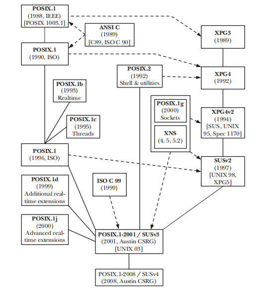

# book_tlpi_notes

[the linux programming interface](https://man7.org/tlpi/)

[amazon](https://www.amazon.com/Linux-Programming-Interface-System-Handbook/dp/1593272200)

## notes
### chapter01 History and Standards
the history of the unix, this story most can see in the [the art of unix programming](https://www.amazon.com/UNIX-Programming-Addison-Wesley-Professional-Computng/dp/0131429019).

In addtion to the POSIX's history, blew:

