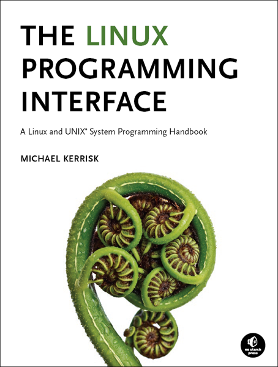

# book_tlpi_notes

[the Linux programming interface](https://man7.org/tlpi/)

[amazon](https://www.amazon.com/Linux-Programming-Interface-System-Handbook/dp/1593272200)


## notes
### chapter01 History and Standards
The history of the Unix, most content can also see in the book -- [the art of Unix programming](https://www.amazon.com/UNIX-Programming-Addison-Wesley-Professional-Computng/dp/0131429019)(chapter01 ~ chapter02).

In addition to the POSIX's history, blow:


### chapter02 Fundamental Concepts
#### 2.1 The kernel
The Kernel refers to the central software that manages and allocates computer resources(CPU, RAM and devices), This also refers to the operating systems.

The kernel's tasks:
1. **Process Schedules**: every process needs CPU and memory to process its tasks. The kernel process scheduler handles the situation like multitasking.
2. **Memory Management**: process has isolation. They can't read or modify other processes' memory, also they can't do these things to the kernel. Keeping some memory to reduce the memory requirements is necessary(maybe it is the cache).
3. **Provision of a file system**: files operations and records.
4. **Creation and Termination of processes**: The kernel can load a new program into memory, providing it with resources(CPU, memory and files). After the termination of processes, the kernel releases the resources.
5. **Access of devices**: The kernel access the devices like mice, keyboards and screens for input and output.
6. **Networking**: The kernel as the agent of the user processes, receives and transmits network messages. Routing network packages.
7. **System call(api)**: Processes can request the kernel to perform various tasks.


内核态和用户态: 
1. 硬件指令允许从一个状态转换到另一个状态
2. 两种状态是隔离的，异常访问会触发硬件异常
3. 内核会干预所有事情，比如一个进程创建另一个进程，一个进程创建一个管道，将数据写到一个文件，事实上就是进程请求内核完成这样的工作，间接性的

#### 2.2 The Shell
命令解释器。bash = `Bournel again shell`, sh = `Bourne shell`

#### 2.3 用户和分组
+ 用户：在`/etc/passwd`文件中记录，用户名，工作目录和使用`shell`
+ 分组：在`/etc/group`文件中，以分号分隔
+ 超级用户：id -- `0`, login name -- `root`

#### 2.4 目录层级，目录， 文件和链接
大致如图：


1. 最高一级是`/`--根目录
2. 文件类型：`regular`, `plain`, `devices`, `pipe`, `sockets`, `目录`和`符号链接`
3. `/..` == `/`
4. 符号链接是文件或者目录的别名，指向的文件不存在是一个悬挂链接(dangling link)
5. 文件名可以最多`255`个字符
6. 路径名称：相对路径和绝对路径
7. 当前工作目录，每个进程都需要
8. 权限和所属，每个文件有权限标识(rwx， 读/写/执行)，都有所属用户和分组，文件夹同

#### 2.5 文件 I/O 模型
1. 文件 `I/O` 模型， Unix, file -- `end-of-file`
2. 文件描述符(file descriptor), I/O 系统指的是使用文件描述符打开文件，通常是一个非负的整数(通常有点小), `open()`函数。0--标准输入(stdin)，1--标准输出(stdout)，2--标准错误(stderr)
3. 熟悉`stdio`阅读[APUE 3rd](https://www.amazon.com/Advanced-Programming-UNIX-Environment-3rd/dp/0321637739)

#### 2.6 程序
1. 源码 -> 编译 -> 链接 -> 程序（二进制机器语言）
2. 过滤器程序：如 cat, grep, sed等
3. c 程序读取命令行参数，`int main(int argc, char *argv[])`， argc 是参数个数，argv[0] 是程序名自身

#### 2.7 进程
1. 进程是在运行程序的实例，执行程序：内核将程序代码加载进`虚拟内存`, 给程序变量分配空间，更新内核对进程的记录信息的数据结构。在内核的视角看，资源的生命周期视进程的需求或者综合的系统需求来确定。进程终止，资源释放可让其他进程使用。
2. 进程逻辑上是分段的(segments)：I. 指令；II. 数据；III. 堆(heap)，动态分配额外内存；VI. 栈(stack)，可收缩内存，供函数调用，返回，局部变量等
3. 进程创建和程序执行：进程可以使用`fork()`系统调用创建新的进程。调用者-->父进程，新进程-->子进程。内核通过弄一份父进程的副本生成子进程。指令(text)在内存中被两个进程共享
4. `execve()`调用加载并完全执行一个新的程序，会将原先进程的所有都会重新被替换。
5. 进程id--pid，父进程id--ppid
6. 进程退出`exit()`，或者`kill`信号，程序结束状态`0`代表成功，非0代表一些错误发生。
7.  进程管理用户id和分组id，标识进程所属
8.  守护进程(daemon processes)，是长期存在的，后台运行的
9.  环境变量列表，用户空间内存。子进程在`fork()`生成之后，也会继承父进程的环境变量列表，这样也是一种父进程的子进程间的通信，而使用`exec()`的新进程生成，要么继承旧的进程的环境变量列表，要么是`exec()`指定使用新的
10. 资源限制：`setrlimit()`系统调用设置上限。`soft limit`: 限制进程可能消耗的资源；`hard limit`设置上限，`soft limit`的调整不能超过此限制。`unprivileged`进程的`soft limit`自动调整范围可能是`0 ~ hard limit`，右边是开区间。`fork()`生成子进程，自动继承父进程的限制配置；资源限制可以使用`ulimit`调整。

#### 2.8 内存映射
1. `mmap()`系统调用在调用的进程的虚拟地址空间，创建新的内存映射
2. 第一部分：将文件映射到进程虚拟内存区域
3. 第二部分：匿名的映射没有任何文件，映射的页初始化为 0
4. 子进程和父进程共享同一个文件映射
5. 基于4，映射是`private`，不会对底层文件有影响(not carried through)，对其他进程不可见
6. 基于4，映射是`shared`，会对底层文件有影响(not carried through)，对其他进程可见
7. 内存映射作用：text 分段，分配新的内存，文件I/O，进程间通信（shared mapping)

#### 2.9 静态和动态库
1. 静态库是编译后的结构化的接口对象，通过静态链接器链接到可执行文件，有修改只需要将可执行文件重新链接静态库文件即可，静态库编译时是需要拷贝库到目标文件的，每个程序都要有一份静态库的拷贝
2. 动态库是在程序运行时通过动态链接器来解决程序的对库函数的调用操作，所有使用此库的进程共享一份拷贝


#### 2.10 进程间通信(IPC)和同步(Synchronization)
1. 信号(signals), 事件发生
2. 管道(pipes), `|`，进程间数据传递，先进先出(FIFO)
3. 套接字(sockets)，进程间数据传递，或者不同主机的网络数据传输
4. 文件锁定(file locking)
5. 消息队列(message queues)
6. semahpores，进程同步动作
7. 共享内存，多个进程共享同一块内存区域，当一个进程更新内容是，其他进程立即可见更动

#### 2.11 信号
1. 信号也叫`软件中断`
2. 整数，名称`SIGxxxx`
3. 内核，另一个进程，或者进程自身发送信号给进程
4. 内核发送信号给进程：用户发送中断`Ctrl C`
5. 内核发送信号给进程：一个进程的子进程终止
6. 内核发送信号给进程：进程设置的时钟过期
7. 内核发送信号给进程：进程试图访问无效内存地址
8. 进程收到信号行为：忽略
9. 进程收到信号行为：killed
10. 进程收到信号行为：暂停执行，等待恢复
11. 当进程为阻塞状态时(block)收到信号，信号状态仍然会维持等待(pending)，直到进程状态是非阻塞

#### 2.12 线程
1. 设想线程为多个进程，共享相同的虚拟内存，其他的一些属性也是一样的
2. 每个线程执行相同的代码，共享相同的数据和堆空间(heap)
3. 每个线程有自己的栈(stack)，包括局部变量存储，函数调用，链接信息等
4. 每个线程可以通过他们共享的全局变量通信
5. 线程api提供**条件变量**和**mutexes(互斥锁)**，通信或者同步行为和他们使用的共享变量
6. 可以使用IPC和同步机制
7. 多处理器可以实现并行处理
8. 共享数据，多线程较为方便
9. 但是这里[UNIX编程艺术](https://book.douban.com/subject/11609943/) 7.1 表示--`线程不是降低而是提高了全局复杂度，除非万不得已，尽量避免使用线程。`

#### 2.13 进程分组和shell工作控制
1. 在有工作控制(job-control)功能的shell中，所有的在管道流程中的进程，都被放进一个新的进程分组或者工作中


#### 2.14 会话，控制终端和控制进程
1. 一个会话`sessions`是一个进程组集合(jobs)，有相同的进程标识符，创建`session`的进程成为`session leader`，进程id编程`session ID`
2. `session`主要被`job-control`shell使用，1中所述进程就是shell
3. `session`有关联的控制终端
4. 打开控制终端，`session leader`变成控制进程，如果推出终端，会收到`SIGHUP`信号


#### 2.15 伪终端
1. 一对互联的虚拟设备(主，从)
2. 双向进程间通信
3. 从设备提供接口，表现得像一个终端
4. 搞不懂

#### 2.16 日期和时间
1. unix 开始时间是`1970-01-01 00:00:00` -- UTC
2. 进程时间（CPU时间），自从启动计， 系统CPU时间（内核态），用户CPU时间（用户态）。
3. `time`命令显示真实时间

#### 2.17 客户端 / 服务端架构
1. 客户端象服务的请求服务，接收服务端回复消息
2. 服务端检查客户端请求内容，根据请求执行相应的合理动作，回复消息给客户端
3. 服务器端封装各种可用的服务供客户端访问


#### 2.18 实时
1. 对输入信息的快速响应的应用
2. 实时可以指在一定可接受的时间范围内做到快速响应
3. 需要考虑可能的冲突问题
4. 本书讨论的标准`POSIX.1b`，Linux所支持的标准


#### 2.19 `/proc`文件构成
1. linux 的文件目录`/proc`
2. 虚拟的文件系统，让内核看起来像是正常的文件系统
3. /proc/PID，每个进程`pid`命名的文件(`ps -ef | grep xxxx`)，可以查看运行在系统上面的进程信息
4. 进程是能在/proc下面做修改的


### 第三章 系统编程的概念
#### 3.1 系统调用
1. 系统调用就是进程对内核发送请求，让内核代表自己进行一些操作
2. 常见操作：创建新进程，执行I/O，创建管理以进行进程间通信
3. 系统调用将处理器的状态从用户态转换到内核态，所以CPU此时能够访问受保护的内核内存
4. 有一系列系统调用是固定的，用唯一的数字标识
5. 用户态和内核态通过系统调用而形成的一定的参数传递
6. 用c库函数的封装器来实现系统调用
7. 通过栈来传递参数给封装器(wrapper)
8. 封装器函数拷贝系统调用数字到专用CPU寄存器(%eax--return寄存器 32 位，64位是 %rax)
9. `trap`, `0x80`,让处理器从用户态到内核态转换
10. 对9的行为处理：I.将寄存器中的值存入内核栈；II.检查系统调用数字的有效性；III.引用合适的系统调用方法，返回结果给`system_call()`方法；VI. 将内核栈上的数据恢复到寄存器，将系统调用的返回值放在栈上；V.返回结果给封装器函数，并且处理器切换为用户态。
11. 系统调用服务返回错误，封装器函数设置全局变量`errno`。Linux上面系统调用服务返回非负值标识成功；如果失败，返回负数。将返回值拷贝到`errno`中。

系统调用流程：


#### 3.2 库函数
1. 一些函数完全不用系统调用，如字符串操作
2. 一些库函数是以系统调用作为底层，如`fopen()`是用`open()`系统调用来打开文件的
3. `printf()`函数提供格式化输出和数据缓存，`write()`系统调用输出一个字节块
4. `malloc()\free()`比`brk()`系统调用分配和释放内存更易用


#### 3.3 标准c库函数和GNU c 库函数
1. [GNU -- glibc](https://www.gnu.org/software/libc/)
2. 查看glibc版本(linux) -- `/lib/libc.so.6`
```c
#include <gnu/libc-version.h>
#include <stdio.h>
const char *gnu_get_libc_version(void);

int main()
{
    printf("version : %s\n", gnu_get_libc_version());
    return 0;
}
```

#### 3.4 系统调用和函数的异常处理
1. 应该总是检查调用状态，保证正常调用成功
2. 如果调用失败，设置全局变量`errno`为正数以标识指定的错误
3. `errno`在头文件`<errno.h>`中
4. 调用成功不会重置`errno`，它会保留上次调用失败的值
5. 检查函数返回值代表的错误，再检查`errno`是否有记录错误的原因
6. 首先将`errno`设置成0， 调用后再检查他的值；调用返回`-1`并且`errno`是非零值，那么发生了错误
7. 打印错误信息：`void perror(const char *msg);` 打印传递的msg参数消息  `<stdio.h>`
8. 打印错误信息：`char *strerror(int errnum);` 返回errnum对应的错误字符串；返回的string是静态分配的，可以被后来者重新覆盖；errnum不能被识别，返回`Unknown error num` `<string.h>`
9. 库函数正常按照系统调用处理错误：调用返回`-1`代表错误发生，设置`errno`标识特定错误；`remove()`移除文件使用的是`unlink()`系统调用，移除文件夹使用的是`rmdir()`系统调用
10. 库函数返回值不是-1，但是会让底层系统调用设置`errno`变量；`fopen()`返回一个`NULL`指针表示错误，`errno`设置值取决于系统调用的失败情况，`perror()`和`strerror()`可以诊断这种情况
11. 库函数压根儿不使用`errno`变量，查看手册确认怎么处理错误的
#### 3.5 书籍代码
1. 命令行解析使用库函数`getopt()`
2. `lib/tlpi_hdr.h`
3. POSIX线程处理错误的返回结果是错误常数
4. `lvalue`左值是一个表达式，它指向一块存储区域；`p`是一个指针，`*p`就是一个左值
5. 在POSIX线程应用接口下面，`errno`定义为一个函数，返回一个指针，指向线程专有的存储

可变参数函数
```c
// n 个参数
int average(int n, ...)
{
    va_list argList; 
    double average = 0.0;
    int sum = 0;
    
    // 初始化多个参数到 argList
    va_start(argList, n);
    int i;
    // 遍历存到 argList 中的多个参数
    for (i=0;i < n; i++) {
        sum += va_arg(argList, int);
    }
    // 清理 argList 变量内存
    va_end(argList);
    return (double) sum / n;
}
```

[练习3-1](https://man7.org/linux/man-pages/man2/reboot.2.html)
- LINUX_REBOOT_MAGIC1: `0xfee1dead`
- LINUX_REBOOT_MAGIC2: `672274793`


### 第四章 文件 I/O, 全局 I/O 模型
#### 4.1 总览
所有执行系统调用的指向打开的文件，是通过文件描述符，是一个非负的证书。包括管道，先进先出(FIFOs)的队列，套接字，终端，设备或者普通文件，导致就是每个进程可能有一系列它自己的文件描述符(file descriptor)。

标准文件的描述符，POSIX标准名字定义在`<unistd.h>`头文件中。注意，可能会更改，比如在`stdout`应用``freopen()`之后，不能再假设地层的文件描述符是1了，可能已经更改。


打开或者创建文件`fd = open(pathname, flags, mode)`, pathname是文件的路径，包括文件名，文件如果不存在，那么会创建它，取决于`flags`的值；如果要创建文件，mode就是指定文件权限的。打开文件之后，就通过`numread = read(fd, buffer, count)`，从打开的文件流`fd`中，读取最多cont个字节，然后存到`buffer`中，返回实际读取的字节数量。接着就是写入文件，`numwritten = write(fd, buffer, count)`，从`buffer`缓冲中，写入到`fd`指向的打开文件中，写入最多count个字节的数据，并返回实际写入的字节数量。最后就是完成所有操作之后对文件的关闭，`status = close(fd)`，释放文件描述符`fd`和关联的内核资源。

#### 4.3 打开文件： `open()`
文件的打开标识`flags mask`如下：

|访问模式|描述|
|-------|-----|
|O_RDONLY|以只读模式打开文件|
|O_WRONLY|以只写模式打开文件|
|O_RDWR|以可读写模式打开文件|

注：`open()`指定`O_CREAT`了，就不能忽略`mode`设定

写入数据总是建议在文件最后追加`O_APPEND`，若是没有指定
```c
/*
 * O_CREAT 如果文件不存在，则创建它
 * O_TRUNC 清空文件
 * O_APPEND 在文件末尾添加
 * 
 * S_IRUSER 文件所有者 -- 读
 * S_IWUSER 文件所有者 -- 写
 */
int fd3 = open("w.log", O_WRONLY | O_CREAT | O_TRUNC | O_APPEND, S_IRUSR | S_IWUSR);
```

`open()`系统调用的参数，标准输入(standard input)的文件描述符是 0


- 第一部分： 文件访问模式标志， 可以使用`fcntl()`的`F_GETFL`操作获取
- 第二部分： 文件创建标志
- 第三部分： 文件打开状态标志， 可以使用`fcntl()`的`F_GETFL`--获取，`F_SETFL`--修改

当文件正常打开返回非负整数的文件描述符，当打开文件时产生错误时，`open()`返回-1, 然后`errno`设置特定的错误原因。

创建文件的系统调用`creat()`等价于`fd = open(pathname, O_WRONLY | O_CREAT | O_TRUNC, mode)`，前者已经被废弃不用了。

`fcntl()`是 Linux 操作系统中非常重要的一个系统调用，它可以对文件描述符进行非常细粒度的控制，使得程序员能够更加灵活地管理打开的文件和进程。

#### 4.4 读取文件--`read()`
系统调用不会给为调用者返回信息的缓冲区分配空间，需要传递一个指针给以前分配好的缓冲区。
```c
#include <unistd.h>

ssize_t read(int fd, void *buffer, size_t count);
```
具体read的使用。
```c
#include <stdio.h>
#include <unistd.h>
#include <fcntl.h>
#include <errno.h>

// 这里定义缓冲区长度和实际读取文件的字符字节数量
// 至少比最大的字符串长一些
#define MAX_READ 20
char buffer[MAX_READ];

int main()
{
    int fd = open("t3.c", O_RDONLY);
    int re = read(fd, buffer, MAX_READ);
    printf("fd %d, re %d, errno %d\n", fd, re, errno);

    printf("The input data was: %s\n", buffer);
    return 0;
}
```
#### 4.5 写入文件--`write()`
宏编译传递
```c
// 如果这里通过命令行传递了 -DM1=nn，那么这个条件判断的宏里面的define不会执行
#ifndef M1
    #define M1 20
#endif
```
[代码](test/t5.c)

#### 4.6 关闭文件--`close()`
两件重要的事情，一是需要对不需要的文件描述符关闭，因为其对进程来说是有限资源。二就是需要对关闭过程进行错误检查，保证正常关闭文件。

#### 4.7 改变文件的偏移量--`lseek()`
文件的偏移量，就是文件内容的第一个字节，偏移量是0，就是相对于文件的开始。

```c
#include <unistd.h>

off_t lseek(int fd, off_t offset, int whence);
```
whence 参数值

| whence | 说明|offset 正负说明|
|--------|-----|-----|
|SEEK_SET|从文件开始设置偏移量为`offset`|非负|
|SEEK_CUR|从文件当前偏移量位置调整`offset`个偏移量|可以正数，负数|
|SEEK_END|文件大小+`offset`，即文件最后一个字节的下一个字节|可以正数，负数|

图示：


示例，获取当前文件偏移量，不改变其值
```c
crr = lseek(fd, 0, SEEK_CUR);
```
```c
lseek(fd, 0, SEEK_SET); /* Start of file */
lseek(fd, 0, SEEK_END); /* Next byte after the end of the file */
lseek(fd, -1, SEEK_END); /* Last byte of file */
lseek(fd, -10, SEEK_CUR); /* Ten bytes prior to current location */
lseek(fd, 10000, SEEK_END); /* 10001 bytes past last byte of file */
```
调用`lseek()`只是简单的调整内核对于关联文件描述符的文件偏移量，不会造成任何物理设备的访问。**不能用于管道，先进先出队列（FIFO），套接字和终端。**,如果错误应用那么会失败，`errno`设置为`ESPIPE`。

大多数操作系统对于文件的空间是以块为单位分配的，块的大小取决于操作系统。

uinx 的IO模型是全局的IO模型，使用系统调用`read(), write(), open(), close()`可以对所有的类型的文件执行IO。文件系统和设备驱动都实现了相同的IO系统调用集合，因为提供给内核的时候，并不能知道是文件系统还是具体设备。


## linux 是怎样工作的
CPU存在内核模式和用户模式两种模式，只有处于内核模式时才允许访问设备。

```sh
sudo apt install sysstat
sar -P ALL 1 1  # 每秒采集一次 共采集 1 次
strace -T -o 01.log ./01 # 打印时间，程序所有系统调用记录，输出为文件格式
strace -tt -o 01.log ./01 # 打印时间，格式化时间，程序所有系统调用记录，输出为文件格式

ldd /bin/echo

# 查看elf详情
readelf -h /bin/sleep
# 取代码段与数据段在文件中的偏移量、大小和起始地址。
# .text对应的是代码段的信息，.data对应的是数据段的信息
readelf -S /bin/sleep  
# ps -eo命令的etime字段和time字段分别表示进程从开始到执行命令为止的运行时间和执行时间。
taskset -c 0 python3 ./loop.py&
ps -eo pid,comm,etime,time
nice -n 5 python3 ./loop.py &
# 查看缺页中断
sar -B 1
# 查看是否发生交换处理
sar -W 1
# 通过kbswpused字段的值了解交换分区使用量的变化趋势即可。如果这个值不断增加，就非常危险。
sar -S 1
# kbpgtbl 查看页表使用的物理内存量
ar -r ALL 1
```
高速缓存是把内存上的数据缓存到高速缓存上，而页面缓存则是将外部存储器上的文件数据缓存到内存上。高速缓存以缓存块为单位处理数据，而页面缓存则以页为单位处理数据。

页面缓存占用的是高速缓存的空间。
```sh
dd if=/dev/zero of=testfile oflag=direct bs=1M count=1K
# if=/dev/zero：使用 /dev/zero 设备作为输入源，即从 /dev/zero 读取数据作为 testfile 的内容。
# of=testfile：指定输出文件为 testfile。
# oflag=direct：使用 direct I/O 模式进行数据传输，直接绕过系统缓存。
# bs=1M：设置每次读写操作的块大小为 1MB。
# count=1K：设置操作的块数为 1K（即 1024），因此总大小为 1GB。
```
安装`sar`系统资源统计工具
```sh
yum install sysstat
```

查看页面缓存
```sh
# buffer/cache
free 
# kbbuffers kbcached
sar -r 1
```
查看页面调入调出
```sh
sar -B 1
```
- pgpgin/s：每秒钟从磁盘读入的页数，即每秒钟发生的页面输入量。
- pgpgout/s：每秒钟写到磁盘的页数，即每秒钟发生的页面输出量。
- fault/s：每秒钟发生的缺页中断数，即每秒钟发生的页面访问错误数。
- majflt/s：每秒钟发生的主缺页中断数，即每秒钟发生的无法通过页面缓存满足的缺页数。
- pgfree/s：每秒钟空闲内存页数，即每秒钟回收的页面数量。
- pgscank/s：每秒钟进行页面扫描的次数。
- pgscand/s：每秒钟扫描的页面数。
- pgsteal/s：每秒钟被回收的页面数，即每秒钟从应用程序中抢占的页面数量。
- %vmeff：虚拟内存使用效率，即主存中不在页面缓存中的页所占的比例。
外部存储器的读写情况
```sh
# rd_sec/s和wr_sec/s分别代表外部存储器（在这里是sda）每秒的读取数据量和写入数据量。
# %util指的是在监测周期（在这个例子中为1秒）内，访问外部存储器消耗的时间所占的比例。
sar -d -p 1
```
脏页的回写周期可以通过sysctl的vm.dirty_writeback_centisecs参数更改
```sh
sysctl vm.dirty_writeback_centisecs
```
Linux中也有当系统内存不足时防止产生剧烈的回写负荷的参数。通过vm.dirty_backgroud_ratio参数可以指定一个百分比值，当脏页占用的内存量与系统搭载的内存总量的比值超过这一百分比值时，后台就会开始运行回写处理
```sh
sysctl vm.dirty_background_rati
```
清理系统缓存
```sh
# 1：清除页缓存（page cache）
# 2：清除回收缓存（dentries和inodes）
# 3：同时清除页缓存和回收缓存
echo 3 > /proc/sys/vm/drop_caches
```
### 附录
系统数据类型
|数据类型|SUSv3 类型要求|描述|
|-------|-------------|-----|
|mode_t |整型|文件权限和类型|
|ssize_t|有符号整型|字节数或者负数错误标识码|
|off_t|有符号整型|文件的偏移量或者大小|
